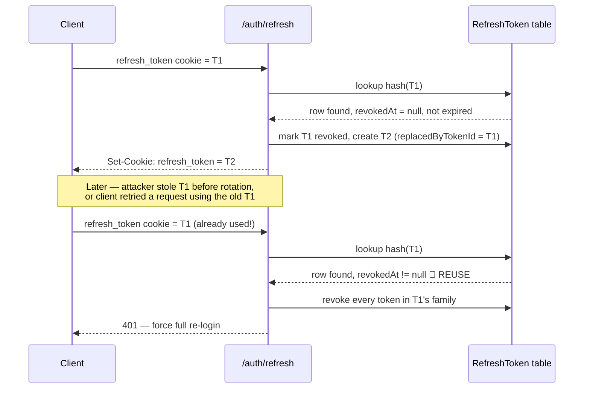
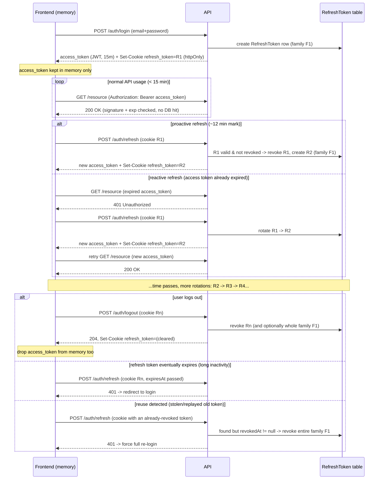

# Refresh Token Manual — Sessions, Opaque Tokens, Rotation, and Fastify Hooks

Companion to [`docs/jwt-manual.md`](./jwt-manual.md). That document covers the
*access token* (a signed JWT). This one covers everything around the
*refresh token*: why it exists, why it should look nothing like a JWT, how
rotation and reuse-detection work, where the access token should live on the
frontend, and a Fastify-specific aside on hook ordering that matters for
wiring auth into the request lifecycle.

---

## 1. Is there still a "session" in a JWT-based system?

Short answer: **the access token is intentionally stateless — but the refresh
token reintroduces a session, on purpose.**

A classic *session* means the **server holds state**: a row (or in-memory
entry) saying "session abc123 belongs to user X, created at T, valid until
T+N." The client only holds an opaque reference to it (traditionally a
`connect.sid`-style cookie). Revocation is trivial: delete the row.

A signed **JWT access token flips this**. The token *itself* carries the
claims (`sub`, `exp`, `aud`, ...) and is self-verifying via its signature —
the server holds **no per-request state**. That's what makes JWT access
tokens fast and horizontally scalable: any service with the public key can
verify a request without a database round-trip.

The cost of that statelessness: **you cannot revoke a single access token
early.** It's valid until `exp`, full stop — unless you build a blocklist,
which defeats the entire "stateless" benefit you wanted in the first place.

The standard resolution:

| | Access token | Refresh token |
|---|---|---|
| Lifetime | Short (minutes) | Long (days/weeks) |
| Statefulness | Stateless (JWT, self-verifying) | **Stateful** — a real session row in the DB |
| Revocable instantly? | No (bounded by short `exp` instead) | Yes — delete/flag the row |
| Used for | Authorizing API calls | Minting new access tokens |

So yes — **you should still have "a session."** It's just scoped to the
refresh token, not the access token. The access token is a short-lived,
disposable *capability* derived from that session, re-minted every ~15
minutes as long as the session (refresh token) is still valid.

---

## 2. Opaque vs JWT refresh tokens

### The analogy

- **JWT** = a note you can read yourself. `header.payload.signature` — the
  payload is merely base64url-encoded, **not encrypted** (see
  `jwt-manual.md` §3). Anyone holding the token can decode and read every
  claim with zero effort. The signature only proves authenticity/integrity,
  not confidentiality. Verifying it is pure cryptography (check the
  signature) — **no database lookup required**.
- **Opaque token** = a raffle ticket number. `crypto.randomBytes(32)` →
  something like `k8F3...Qz1`. It is **pure entropy** — it encodes no
  information about who it belongs to or when it expires. The *only* way to
  learn anything about it is to look it up in the issuer's ledger (your
  database). Verifying it is **always a DB query**.

### Why this matters — a direct comparison

| | JWT refresh token | Opaque refresh token |
|---|---|---|
| **Format** | Structured, self-contained claims | Random bytes, no internal structure |
| **Verification** | Signature check — no DB hit | DB/cache lookup — always a DB hit |
| **Revocation** | Hard. Valid until `exp` unless you maintain a blocklist (which means... you need DB state anyway) | Trivial — flag/delete the row, done |
| **What an attacker learns if it leaks** | Everything in the payload (user id, roles, issued-at...) — readable without any key | Nothing. It's indistinguishable from random noise |
| **Rotation bookkeeping (who replaced whom, reuse detection)** | Needs extra claims (`jti`, a `family` id) *and* a DB table to track rotation state anyway | Natural fit — the DB row *is* the rotation state |
| **Size** | Larger (header + claims + signature, base64url) | Small, fixed-size random string |

### The punchline

If you need database state **regardless** — for revocation, for rotation
tracking, for reuse detection — then the JWT's main selling point
("self-verifying, no DB hit") buys you **nothing** for the refresh token. You'd
be paying for signature verification machinery to reinvent something you're
going to DB-check anyway, while *also* leaking readable claims if it's
stolen.

**Conclusion used in this project:**
- **Access token → JWT.** Stateless verification is the entire point; it's
  short-lived so the "can't revoke early" cost is small and bounded.
- **Refresh token → opaque random string, hashed before storage.** It's
  explicitly a session reference. Be honest about that and get trivial
  revocation, rotation, and reuse detection for free.

> Never store the raw opaque token in the database — store `sha256(token)`
> and compare hashes. If your database ever leaks, an attacker shouldn't be
> able to use the leaked rows as working refresh tokens. (Opaque tokens are
> high-entropy random data, not low-entropy user secrets like passwords, so a
> fast hash like SHA-256 is appropriate here — unlike passwords, which need a
> slow, salted hash like Argon2 to resist brute-forcing a small guess space.)

---

## 3. Rotation and reuse detection

A refresh token should be **single-use**: redeeming it at `/auth/refresh`
immediately invalidates it and issues a brand-new one. This is called
**refresh token rotation**, and it's what makes **reuse detection** possible.



### Why this catches reuse

Every refresh token is single-use. The moment it's redeemed, its row is
marked `revokedAt`. If that **same raw token** is ever presented again, the
lookup finds a row that's *already* revoked — that can only happen if two
parties ended up holding the same token (a thief who copied it, or a client
bug that replayed an old value). Rather than trying to guess which caller is
legitimate, the safe move is to **revoke the entire token family** — every
token descended from the same original login — forcing a real re-login. This
is the pattern described in the OAuth 2.0 Security Best Current Practice for
public clients, and used by providers like Auth0.

### What a "token family" actually is

Think of a token family as **one continuous relay race, starting at login**.
Each refresh token is one runner carrying the baton for a while, then handing
it to the next runner (rotation). The **team** — every runner from the first
to the current one — is the **family** (`familyId`). The baton (the user's
authenticated session) is the same the whole race; only who's currently
holding it changes. `R1 → R2 → R3 → R4` are all the *same family* — one row
per rotation, all sharing one `familyId`; `replacedByTokenId` lets you walk
the chain (R1 replaced by R2, R2 by R3, ...) for debugging/auditing.

Why you revoke the whole *team*, not just the flagged runner: if an attacker
stole R3's baton **after** it was already handed off to R4, and you only
revoked R3 individually, R4/R5/R6... (minted *after* the theft) might already
be compromised too — the attacker could have used the stolen token to mint a
fresh one before you ever noticed. You don't know how far it propagated, so
the only safe response is to end the whole lineage and force a brand new
login (a brand new `familyId`).

### A real nuance: benign races vs. actual attacks

"Any reuse of a revoked token = compromise" is the simple rule above, but it
has a false-positive case worth knowing: **multiple tabs of the same app**
share the same refresh cookie but have *separate* JS memory. If tab A
refreshes (`R1 → R2`) a split second before tab B also tries to use `R1`
(unaware it was just rotated), the server sees "already-revoked token reused"
— indistinguishable from an attack — and would revoke the whole family,
logging the user out of every tab for no real reason.

The standard mitigation (used by Auth0, documented in the OAuth 2.0 rotation
BCP) is a **short reuse grace window**: if an already-rotated token is
presented again within a few seconds of its rotation, treat it as a benign
race and just return the *same* replacement token again, instead of revoking
the family. Only treat it as a real attack if the reused token shows up well
after its replacement was issued (minutes/hours later — a strong signal of a
genuinely stolen, stale token).

> **Scope for this lesson**: the grace window *is* included in this project's
> basic implementation — it's cheap (one timestamp comparison) and meaningfully
> reduces false positives. What's deferred as a follow-up is the **frontend**
> half of this problem (see "Dedupe vs. grace window" below), since there's no
> frontend in this repo.

### Dedupe (client) vs. grace window (server) — two different layers

These solve overlapping but distinct problems, and you need to know which is
whose job:

| | Single-flight dedupe | Grace window |
|---|---|---|
| **Lives in** | Frontend (JS) | Backend (`rotateRefreshToken`) |
| **Prevents** | *One tab* firing N redundant `/auth/refresh` calls when N requests 401 at once | Reuse-detection false-positives when the *same* token legitimately reaches the server twice (different tabs, retried request, network jitter) |
| **Scope** | Only within one JS runtime/tab | Any caller, any tab — a property of the server's rotation logic |
| **This repo's job?** | No — there's no frontend here; this is an SDK/app-level concern to remember later | **Yes** — implemented directly in this basic pass |

Dedupe alone doesn't help across tabs (each tab has independent JS memory,
but they share the same cookie jar). The grace window alone is more wasteful
without dedupe (nothing stops a sloppy frontend from firing 5 parallel
refresh calls instead of 1) — but it's still *correct*, just less efficient.
They're complementary: dedupe reduces how often the race happens, the grace
window makes the server tolerant when it happens anyway.

### Why rotate on *every* call — not just when the token is near expiry

A tempting shortcut is "only rotate if the refresh token is close to
`expiresAt`, otherwise just let the same one keep being reused." **Don't.**
Reuse detection only works *because* every token is single-use. If the same
refresh token stayed valid and reusable for its entire TTL (say, 30 days),
a stolen token would be indistinguishable from the legitimate one for the
**whole 30 days** — both present a "valid, unexpired" token, and valid
tokens are allowed to repeat under that scheme. Rotation changes the
question from *"is this still within its TTL?"* to *"has this exact value
been consumed before?"* — detecting compromise within seconds instead of up
to a month later. Expiry and rotation are separate mechanisms: expiry bounds
the **outer lifetime** of a family; rotation happens on **every single
redemption**, regardless of how much TTL remains.

### Fixed vs. sliding expiry — a real design choice

When a token is rotated, should the replacement's `expiresAt` be:

| Approach | Behavior | Tradeoff |
|---|---|---|
| **Fixed/absolute** — every token in a family inherits the *original* `expiresAt` set at login | Hard cutoff (e.g. 30 days) no matter how actively the user is using the app — forced re-login | Simple; bounds a session to a hard maximum — good for compliance-style "re-auth every N days" policies |
| **Sliding** — each rotated token gets a fresh `expiresAt = now + TTL` | An actively-used session renews itself indefinitely, never forcing re-login while the user keeps coming back | Matches "stay logged in while active" UX — but needs a separate **absolute max** cap too, or a session could live forever |

There's no universally correct answer — it's a product/security tradeoff to
make deliberately, not a default to inherit silently.

### Data model implications

To support this you need, per refresh token row, roughly:

- `tokenHash` — sha256 of the raw token (unique, indexed — this is your
  primary lookup key)
- `userId` — whose session this is
- `familyId` — groups all tokens descended from one original login; revoking
  a family = revoking everything with that id
- `expiresAt` — absolute TTL, independent of rotation
- `revokedAt` — null while active; set the instant it's rotated-away *or*
  reuse is detected
- `replacedByTokenId` — optional, lets you trace the rotation chain for
  debugging/auditing

---

## 3a. When should the frontend actually call `/auth/refresh`?

It is **not** called before every access-token usage — the access token is
still attached directly to every normal API call
(`Authorization: Bearer <access_token>`) and verified by signature alone, with
**no DB hit and no refresh call involved**. That statelessness is the entire
point of §1. During 15 minutes of normal usage with dozens of API calls,
`/auth/refresh` is called **zero** times.

It's only called at specific moments:

| Trigger | Why |
|---|---|
| **On app boot / full page reload** | The in-memory access token (§4) was wiped by the reload; the httpOnly refresh cookie survived. Need a fresh access token before rendering anything authenticated. |
| **Proactively, shortly before `exp`** | Know the access token's lifetime (e.g. 15 min) and refresh a bit early (e.g. at ~12 min) so the user never sees a failed request from natural expiry. |
| **Reactively, on a 401** | Belt-and-suspenders for clock drift or a skipped proactive refresh: API call → 401 → refresh once → retry the original request → if refresh itself fails, that's a real "you're logged out." |

The race condition discussed above only matters around this narrow window —
specifically the reactive case, when several requests 401 around the same
moment and each independently tries to refresh.

---

| Storage | XSS risk | CSRF risk | Survives reload | Notes |
|---|---|---|---|---|
| **In-memory JS variable** (e.g. a module-level var or a store, re-fetched via refresh on page load) | Low — not reachable via `document.cookie` or storage APIs, but still readable by injected JS *while running* | None (not auto-sent) | No — lost on refresh, must call `/auth/refresh` on boot | **Recommended** for the access token |
| `localStorage` / `sessionStorage` | **High** — any injected script can read it directly, synchronously, trivially | None | Yes | Avoid for tokens — this is explicitly called out as a bad practice in `jwt-manual.md` §8 |
| Cookie (`httpOnly`) | Low — JS can't read it at all | **Yes** — browser auto-attaches it to matching-origin requests, so you need CSRF mitigation | Yes | Good fit for the **refresh token** (rarely sent, high-value), overkill/awkward for an access token you attach to every API call via `Authorization` header |

**Recommendation used in this project:**
- **Access token**: kept in memory only (never persisted). On full page
  reload, the app silently calls `/auth/refresh` (using the httpOnly refresh
  cookie) to get a new access token before rendering anything that needs
  auth.
- **Refresh token**: `httpOnly`, `Secure`, `SameSite=Lax` cookie — invisible
  to JS entirely, so an XSS bug can't directly exfiltrate it. (CSRF
  double-submit protection for the cookie-based refresh/logout endpoints is
  flagged as a deliberate follow-up, not implemented in this basic pass.)

The reasoning: XSS (a malicious script running in your page) is the more
common real-world threat than CSRF for an API-style backend, so prioritize
denying JS *any* access to the long-lived credential (the refresh token),
while accepting that the short-lived access token sits in memory where a
successful XSS attack *could* still grab it for ~15 minutes — a much smaller
blast radius than a stolen long-lived token in `localStorage`.

---

## 5. `onRequest` vs `preHandler` — Fastify hook ordering

Fastify runs a request through an ordered pipeline of hooks before your route
handler ever executes:

```
onRequest → preParsing → preValidation → (body/query validation) → preHandler → handler
```

| Hook | Runs before... | Typical use |
|---|---|---|
| `onRequest` | Body parsing, validation | Things that don't need the parsed body: auth header presence checks, rate limiting, CORS, request logging/tracing |
| `preHandler` | The route handler, but *after* schema validation | Things that may need the validated body/query, or that should only run for requests that already passed validation — e.g. authorization checks that use `request.body` |

**Why `authGuard` in this project is registered as `preHandler`, not
`onRequest`**: it doesn't need the body, so either technically works — but
`preHandler` is the conventional place for "is this request allowed to reach
the handler" checks, keeping `onRequest` free for cross-cutting concerns
(logging, rate limiting) that should apply uniformly, even to requests that
will later fail body validation.

**Practical rule of thumb:**
- Needs the request body/query to decide anything? → must be `preHandler`
  (it runs after validation) or later.
- Pure header/connection-level concern (rate limiting by IP, auth presence,
  CORS) that should run for *every* request regardless of body shape? →
  `onRequest` is cheaper and runs earliest.

This is why the rate limiter (`@fastify/rate-limit`) hooks in at
`onRequest`-equivalent timing internally — it needs to reject abusive
requests **before** paying the cost of body parsing/validation/your handler.

---

## 6. Full Picture — Token Lifecycle Diagram

Putting §1–§5 together into one timeline, across a whole login session:



**Key things to notice in this diagram:**
- The **access token never touches the database** — every normal API call is a pure signature check.
- The **refresh token is the only thing that ever touches `/auth/refresh`**, and every successful use **replaces itself** (`R1 → R2 → R3 → ...`) — same `familyId` the whole time.
- There are exactly **three ways a refresh token's story ends**: explicit logout, natural `expiresAt`, or reuse-triggered family revocation. All three land the user back at the login screen.

---

## 7. Quick Reference Summary

- **Session**: still exists in a JWT system — it just lives at the refresh
  token layer, not the access token layer.
- **JWT = self-contained & readable, verified by signature, no DB hit.**
  **Opaque = meaningless alone, verified by DB lookup, trivially revocable.**
- Access token → JWT (stateless, short-lived). Refresh token → opaque,
  hashed at rest (stateful, long-lived, revocable).
- Rotation = single-use refresh tokens, on **every** redemption (not just near
  expiry) — expiry and rotation are separate, unrelated mechanisms. Reuse
  detection = if an already-revoked token is presented again, revoke its
  whole family and force re-login (with a short grace window to tolerate
  benign multi-tab races, implemented server-side in this project).
- `/auth/refresh` is called at specific moments only (boot, proactive
  pre-expiry, reactive on 401) — never before every single API call.
- Fixed vs. sliding expiry on rotation is a deliberate product/security
  choice, not a default to inherit silently.
- Access token: keep in memory on the frontend, never `localStorage`.
  Refresh token: `httpOnly` cookie.
- `onRequest` = earliest, body-agnostic (rate limiting, auth presence).
  `preHandler` = after validation, for checks that may need the parsed
  body/query.

