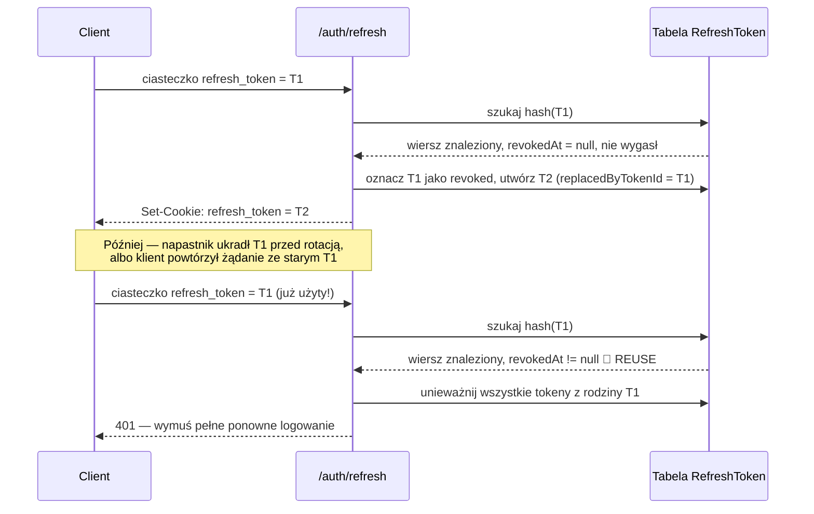
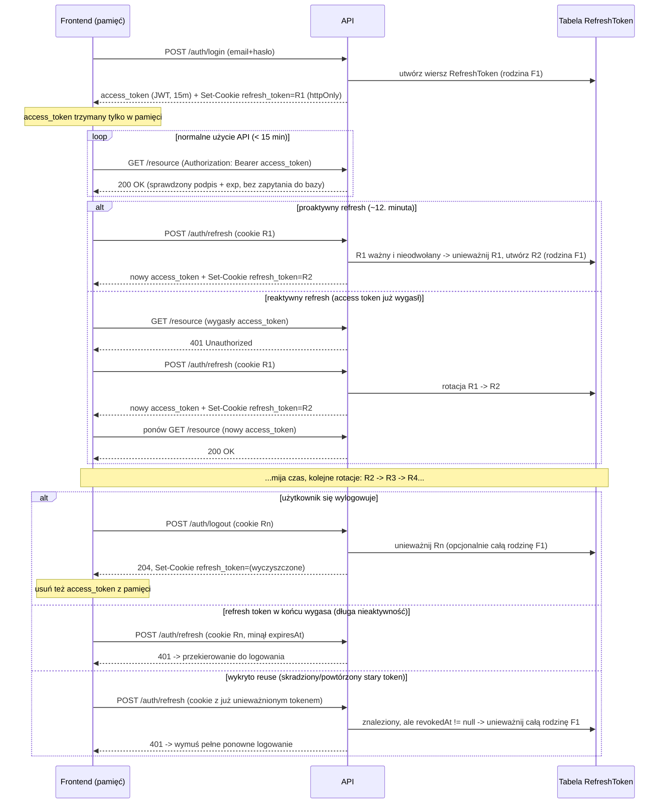

# Podręcznik Refresh Tokenów — Sesje, Tokeny Opaque, Rotacja i Hooki Fastify

Materiał towarzyszący do [`docs/jwt-manual.md`](./jwt-manual.md). Tamten
dokument opisuje *access token* (podpisany JWT). Ten dokument opisuje
wszystko wokół *refresh tokenu*: dlaczego w ogóle istnieje, dlaczego nie
powinien wyglądać jak JWT, jak działa rotacja i wykrywanie ponownego użycia
(reuse detection), gdzie na froncie powinien żyć access token, oraz
dygresję o kolejności hooków w Fastify, która ma znaczenie przy podpinaniu
autoryzacji do cyklu życia żądania.

---

## 1. Czy w systemie opartym o JWT nadal istnieje "sesja"?

Krótka odpowiedź: **access token jest celowo bezstanowy (stateless) — ale
refresh token celowo przywraca sesję.**

Klasyczna *sesja* oznacza, że **serwer trzyma stan**: wiersz (albo wpis w
pamięci) mówiący "sesja abc123 należy do użytkownika X, utworzona o czasie T,
ważna do T+N". Klient trzyma tylko nieprzezroczyste odwołanie do niej
(tradycyjnie ciasteczko w stylu `connect.sid`). Unieważnienie jest trywialne:
usuń wiersz.

Podpisany **JWT jako access token odwraca ten model**. Sam token niesie
w sobie dane (`sub`, `exp`, `aud`, ...) i sam się weryfikuje dzięki
podpisowi — serwer **nie trzyma żadnego stanu per-request**. Właśnie dzięki
temu access tokeny JWT są szybkie i skalują się horyzontalnie: dowolny
serwis z kluczem publicznym może zweryfikować żądanie bez zapytania do bazy
danych.

Koszt tej bezstanowości: **nie da się unieważnić pojedynczego access tokenu
przedwcześnie.** Jest ważny aż do `exp`, kropka — chyba że zbudujesz listę
odwołanych tokenów (blocklist), co niweczy cały sens "bezstanowości", po którą
sięgnąłeś.

Standardowe rozwiązanie tego problemu:

| | Access token | Refresh token |
|---|---|---|
| Czas życia | Krótki (minuty) | Długi (dni/tygodnie) |
| Stanowość | Bezstanowy (JWT, sam się weryfikuje) | **Stanowy** — prawdziwy wiersz sesji w bazie |
| Można unieważnić natychmiast? | Nie (ograniczamy ryzyko krótkim `exp`) | Tak — usuń/oznacz wiersz |
| Używany do | Autoryzacji wywołań API | Wydawania nowych access tokenów |

Czyli tak — **nadal powinieneś mieć "sesję".** Jest ona tylko ograniczona do
poziomu refresh tokenu, a nie access tokenu. Access token to krótkotrwała,
jednorazowa *zdolność* wyprowadzona z tej sesji, wydawana na nowo co ~15
minut, dopóki sesja (refresh token) jest nadal ważna.

---

## 2. Refresh token: opaque czy JWT?

### Analogia

- **JWT** = notatka, którą możesz sam odczytać. `header.payload.signature` —
  payload jest jedynie zakodowany w base64url, **nie zaszyfrowany** (patrz
  `jwt-manual.md` §3). Każdy, kto ma token, może go zdekodować i odczytać
  każdy claim bez żadnego wysiłku. Podpis dowodzi jedynie autentyczności/
  integralności, nie poufności. Weryfikacja to czysta kryptografia
  (sprawdzenie podpisu) — **bez zapytania do bazy danych**.
- **Token opaque** = numerek z loterii. `crypto.randomBytes(32)` → coś w
  stylu `k8F3...Qz1`. To **czysta entropia** — nie koduje żadnej informacji o
  tym, do kogo należy ani kiedy wygasa. Jedyny sposób, by się czegoś o nim
  dowiedzieć, to sprawdzić go w rejestrze wydawcy (twojej bazie danych).
  Weryfikacja to **zawsze zapytanie do bazy**.

### Dlaczego to ma znaczenie — porównanie wprost

| | JWT jako refresh token | Opaque jako refresh token |
|---|---|---|
| **Format** | Strukturalny, samowystarczalny zestaw claimów | Losowe bajty, bez żadnej struktury |
| **Weryfikacja** | Sprawdzenie podpisu — bez zapytania do bazy | Zapytanie do bazy/cache — zawsze |
| **Unieważnienie** | Trudne. Ważny do `exp`, chyba że trzymasz blocklistę (czyli... i tak potrzebujesz stanu w bazie) | Trywialne — oznacz/usuń wiersz, koniec |
| **Co wycieka napastnikowi, jeśli token wycieknie** | Wszystko z payloadu (id użytkownika, role, czas wydania...) — czytelne bez żadnego klucza | Nic. To nieodróżnialne od losowego szumu |
| **Księgowanie rotacji (kto zastąpił kogo, wykrywanie reuse)** | Wymaga dodatkowych claimów (`jti`, id "rodziny") *i tak* oraz tabeli w bazie do śledzenia stanu rotacji | Naturalne dopasowanie — wiersz w bazie *jest* stanem rotacji |
| **Rozmiar** | Większy (nagłówek + claimy + podpis, base64url) | Mały, stały rozmiar losowego ciągu |

### Puenta

Jeśli i tak potrzebujesz stanu w bazie danych — do unieważniania, śledzenia
rotacji, wykrywania reuse — to główna zaleta JWT ("samoweryfikujący się, bez
zapytania do bazy") **nic ci nie daje** dla refresh tokenu. Płacisz za
mechanizm weryfikacji podpisu, żeby na nowo wynaleźć coś, co i tak sprawdzisz
w bazie, a w dodatku **wyciekają czytelne claimy**, jeśli token zostanie
skradziony.

**Wniosek przyjęty w tym projekcie:**
- **Access token → JWT.** Bezstanowa weryfikacja to cały sens; jest
  krótkotrwały, więc koszt "nie da się unieważnić wcześniej" jest mały i
  ograniczony w czasie.
- **Refresh token → losowy ciąg opaque, haszowany przed zapisem.** To
  jawnie odwołanie do sesji. Bądź z tym szczery, a w zamian dostajesz za
  darmo trywialne unieważnianie, rotację i wykrywanie reuse.

> Nigdy nie zapisuj surowego tokenu opaque w bazie danych — zapisuj
> `sha256(token)` i porównuj hashe. Jeśli baza kiedykolwiek wycieknie,
> napastnik nie powinien móc użyć wyciekłych wierszy jako działających
> refresh tokenów. (Tokeny opaque to dane losowe o wysokiej entropii, a nie
> niskoentropijne sekrety użytkownika jak hasła, więc szybki hash typu
> SHA-256 jest tu odpowiedni — w przeciwieństwie do haseł, które potrzebują
> wolnego, solonego hasha jak Argon2, by odeprzeć brute-force na małej
> przestrzeni odgadywania.)

---

## 3. Rotacja i wykrywanie ponownego użycia (reuse detection)

Refresh token powinien być **jednorazowy**: wymiana go na endpointzie
`/auth/refresh` natychmiast go unieważnia i wydaje zupełnie nowy. Nazywa się
to **rotacją refresh tokenów** i to właśnie ona umożliwia **wykrywanie
reuse**.



### Dlaczego to wykrywa reuse

Każdy refresh token jest jednorazowy. W momencie wymiany jego wiersz zostaje
oznaczony jako `revokedAt`. Jeśli ten **sam surowy token** zostanie
przedstawiony ponownie, wyszukiwanie znajdzie wiersz, który jest **już**
unieważniony — a to może się zdarzyć tylko wtedy, gdy ten sam token miały
dwie strony (złodziej, który go skopiował, albo błąd klienta, który powtórzył
starą wartość). Zamiast zgadywać, który z wywołujących jest prawowity,
bezpiecznym ruchem jest **unieważnienie całej "rodziny" tokenów** — wszystkich
tokenów wywodzących się z tego samego oryginalnego logowania — wymuszając
prawdziwe ponowne logowanie. To wzorzec opisany w OAuth 2.0 Security Best
Current Practice dla klientów publicznych, stosowany m.in. przez Auth0.

### Czym naprawdę jest "rodzina tokenów"

Wyobraź sobie rodzinę tokenów jako **jeden ciągły bieg sztafetowy, zaczynający
się od logowania**. Każdy refresh token to jeden biegacz niosący pałeczkę
przez chwilę, po czym przekazujący ją kolejnemu (rotacja). **Drużyna** —
wszyscy biegacze od pierwszego do obecnego — to **rodzina** (`familyId`).
Pałeczka (uwierzytelniona sesja użytkownika) jest ta sama przez cały bieg;
zmienia się tylko to, kto ją aktualnie niesie. `R1 → R2 → R3 → R4` to cała
ta sama rodzina — jeden wiersz na rotację, wszystkie z tym samym
`familyId`; `replacedByTokenId` pozwala przejść po łańcuchu (R1 zastąpiony
przez R2, R2 przez R3, ...) do celów debugowania/audytu.

Dlaczego unieważnia się całą *drużynę*, a nie tylko oznaczonego biegacza:
jeśli napastnik ukradł pałeczkę R3 **po tym**, jak już została przekazana do
R4, a ty unieważniłbyś tylko R3, to R4/R5/R6... (wydane *po* kradzieży) też
mogą być już skompromitowane — napastnik mógł użyć skradzionego tokenu, by
wyrobić sobie nowy, zanim cokolwiek zauważyłeś. Nie wiesz, jak daleko sięgnął
problem, więc jedyną bezpieczną reakcją jest zakończenie całej linii i
wymuszenie zupełnie nowego logowania (nowej `familyId`).

### Prawdziwy niuans: niewinne race'y a prawdziwe ataki

"Każde ponowne użycie unieważnionego tokenu = kompromitacja" to prosta
zasada powyżej, ale ma jeden przypadek fałszywie pozytywny, o którym warto
wiedzieć: **wiele kart tej samej aplikacji** dzieli to samo ciasteczko
refresh tokenu, ale ma *osobną* pamięć JS. Jeśli karta A wykona refresh
(`R1 → R2`) ułamek sekundy przed tym, zanim karta B spróbuje użyć R1 (nie
wiedząc, że właśnie został obrócony), serwer widzi "ponowne użycie już
unieważnionego tokenu" — nieodróżnialne od ataku — i unieważniłby całą
rodzinę, wylogowując użytkownika ze wszystkich kart bez żadnego realnego
powodu.

Standardową mitygacją (stosowaną przez Auth0, opisaną w OAuth 2.0 rotation
BCP) jest **krótkie okno tolerancji na reuse**: jeśli już obrócony token
zostanie przedstawiony ponownie w ciągu kilku sekund od rotacji, traktuj to
jako niewinny race i po prostu zwróć ponownie *ten sam* token zastępujący,
zamiast unieważniać rodzinę. Dopiero jeśli ponownie użyty token pojawia się
długo po wydaniu jego zastępstwa (minuty/godziny później — mocny sygnał
prawdziwie skradzionego, nieaktualnego tokenu), traktuj to jako realny atak.

> **Zakres tej lekcji**: okno tolerancji *jest* zaimplementowane w tym
> podstawowym podejściu — to tanie (jedno porównanie znaczników czasu) i
> znacząco zmniejsza liczbę fałszywych alarmów. To, co jest odłożone na
> przyszłość, to **frontendowa** połowa tego problemu (patrz "Deduplikacja
> vs. okno tolerancji" poniżej) — bo w tym repozytorium nie ma frontendu.

### Deduplikacja (klient) vs. okno tolerancji (serwer) — dwie różne warstwy

Te mechanizmy rozwiązują nakładające się, ale odrębne problemy — warto
wiedzieć, czyja to odpowiedzialność:

| | Deduplikacja (single-flight) | Okno tolerancji |
|---|---|---|
| **Żyje w** | Frontend (JS) | Backend (`rotateRefreshToken`) |
| **Zapobiega** | Wywołaniu N zbędnych żądań `/auth/refresh` *z jednej karty*, gdy N żądań dostaje 401 naraz | Fałszywym alarmom wykrywania reuse, gdy *ten sam* token legalnie dociera do serwera dwa razy (różne karty, powtórzone żądanie, opóźnienia sieci) |
| **Zasięg** | Tylko w obrębie jednego środowiska JS/karty | Dowolny wywołujący, dowolna karta — cecha logiki rotacji serwera |
| **Zadanie tego repo?** | Nie — nie ma tu frontendu; to sprawa do zapamiętania na poziomie SDK/aplikacji | **Tak** — zaimplementowane bezpośrednio w tym podstawowym podejściu |

Sama deduplikacja nie pomaga między kartami (każda karta ma osobną pamięć
JS, ale współdzielą ten sam słoik z ciasteczkami). Samo okno tolerancji bez
deduplikacji jest bardziej marnotrawne (nic nie powstrzymuje niechlujnego
frontendu przed wystrzeleniem 5 równoległych żądań refresh zamiast 1) — ale
nadal jest *poprawne*, tylko mniej wydajne. Są komplementarne: deduplikacja
zmniejsza częstość race'a, a okno tolerancji sprawia, że serwer jest
wyrozumiały, gdy mimo wszystko się zdarzy.

### Dlaczego rotować przy *każdym* wywołaniu — nie tylko blisko wygaśnięcia

Kuszącym skrótem jest "rotuj tylko, gdy refresh token jest blisko
`expiresAt`, a poza tym niech ten sam token będzie używany wielokrotnie."
**Nie rób tego.** Wykrywanie reuse działa tylko *dlatego*, że każdy token
jest jednorazowy. Gdyby ten sam refresh token pozostawał ważny i
wielokrotnego użytku przez cały swój TTL (powiedzmy 30 dni), skradziony
token byłby nieodróżnialny od prawowitego przez **cały ten miesiąc** — oba
prezentują "ważny, niewygasły" token, a ważne tokeny mogą się powtarzać w
tym schemacie. Rotacja zmienia pytanie z *"czy to jest nadal w ramach
TTL?"* na *"czy ta konkretna wartość była już użyta?"* — wykrywając
kompromitację w ciągu sekund zamiast nawet miesiąca później. Wygaśnięcie i
rotacja to osobne mechanizmy: wygaśnięcie ogranicza **zewnętrzny czas
życia** rodziny; rotacja zachodzi przy **każdej pojedynczej wymianie**,
niezależnie od tego, ile TTL zostało.

### Wygaśnięcie stałe vs. przesuwne — realny wybór projektowy

Gdy token jest rotowany, czy `expiresAt` nowego tokenu powinno:

| Podejście | Zachowanie | Kompromis |
|---|---|---|
| **Stałe/bezwzględne** — każdy token w rodzinie dziedziczy *oryginalny* `expiresAt` ustalony przy logowaniu | Twardy limit (np. 30 dni) niezależnie od aktywności — wymuszone ponowne logowanie | Proste; ogranicza sesję do twardego maksimum — dobre dla polityk zgodności typu "re-auth co N dni" |
| **Przesuwne** — każdy obrócony token dostaje świeże `expiresAt = teraz + TTL` | Aktywnie używana sesja odnawia się bez końca, nigdy nie wymuszając ponownego logowania, dopóki użytkownik wraca | Pasuje do UX "zostań zalogowany, gdy jesteś aktywny" — ale potrzebuje osobnego **bezwzględnego limitu**, inaczej sesja mogłaby żyć wiecznie |

Nie ma jednej uniwersalnie poprawnej odpowiedzi — to świadomy kompromis
produktowo-bezpieczeństwowy do podjęcia, a nie domyślna wartość do
odziedziczenia bez namysłu.

### Konsekwencje dla modelu danych

Żeby to wspierać, potrzebujesz mniej więcej takich pól na wiersz refresh
tokenu:

- `tokenHash` — sha256 surowego tokenu (unikalny, indeksowany — to twój
  główny klucz wyszukiwania)
- `userId` — do kogo należy ta sesja
- `familyId` — grupuje wszystkie tokeny wywodzące się z jednego oryginalnego
  logowania; unieważnienie rodziny = unieważnienie wszystkiego z tym id
- `expiresAt` — bezwzględny TTL, niezależny od rotacji
- `revokedAt` — null, dopóki token jest aktywny; ustawiane natychmiast po
  rotacji *lub* po wykryciu reuse
- `replacedByTokenId` — opcjonalne, pozwala prześledzić łańcuch rotacji przy
  debugowaniu/audycie

---

## 3a. Kiedy frontend powinien faktycznie wywołać `/auth/refresh`?

**Nie** jest wywoływany przed każdym użyciem access tokenu — access token
wciąż jest dołączany bezpośrednio do każdego normalnego wywołania API
(`Authorization: Bearer <access_token>`) i weryfikowany wyłącznie podpisem,
**bez zapytania do bazy i bez wywołania refresh**. Ta bezstanowość to cały
sens §1. Podczas 15 minut normalnego użytkowania, przy dziesiątkach wywołań
API, `/auth/refresh` jest wywoływany **zero** razy.

Jest wywoływany tylko w konkretnych momentach:

| Moment | Dlaczego |
|---|---|
| **Przy starcie aplikacji / pełnym odświeżeniu strony** | Access token w pamięci (§4) został wyczyszczony przez odświeżenie; ciasteczko refresh przetrwało. Potrzeba świeżego access tokenu przed wyrenderowaniem czegokolwiek wymagającego autoryzacji. |
| **Proaktywnie, krótko przed `exp`** | Znasz czas życia access tokenu (np. 15 min) i odświeżasz go nieco wcześniej (np. przy ~12. minucie), żeby użytkownik nigdy nie zobaczył nieudanego żądania z powodu naturalnego wygaśnięcia. |
| **Reaktywnie, przy 401** | Zabezpieczenie na wypadek przesunięcia zegara albo pominiętego proaktywnego refreshu: wywołanie API → 401 → refresh raz → ponów oryginalne żądanie → jeśli sam refresh zawiedzie, to prawdziwe "jesteś wylogowany." |

Race condition omówiony powyżej dotyczy tylko tego wąskiego okna —
konkretnie przypadku reaktywnego, gdy kilka żądań dostaje 401 w tym samym
momencie i każde niezależnie próbuje się odświeżyć.

---

| Miejsce przechowywania | Ryzyko XSS | Ryzyko CSRF | Przeżywa odświeżenie strony | Uwagi |
|---|---|---|---|---|
| **Zmienna JS w pamięci** (np. zmienna modułowa albo store, odtwarzana przez refresh przy starcie strony) | Niskie — nieosiągalne przez `document.cookie` ani API storage, ale nadal czytelne przez wstrzyknięty JS *podczas działania* | Brak (nie jest wysyłana automatycznie) | Nie — ginie przy odświeżeniu, trzeba wywołać `/auth/refresh` przy starcie | **Zalecane** dla access tokenu |
| `localStorage` / `sessionStorage` | **Wysokie** — każdy wstrzyknięty skrypt może go odczytać bezpośrednio, synchronicznie, trywialnie | Brak | Tak | Unikać dla tokenów — wprost wskazane jako zła praktyka w `jwt-manual.md` §8 |
| Ciasteczko (`httpOnly`) | Niskie — JS w ogóle nie ma do niego dostępu | **Tak** — przeglądarka automatycznie dołącza je do pasujących żądań, więc trzeba mitygować CSRF | Tak | Dobre dopasowanie dla **refresh tokenu** (rzadko wysyłany, wysoka wartość), niewygodne dla access tokenu, który i tak dołączasz do każdego wywołania API przez nagłówek `Authorization` |

**Rekomendacja przyjęta w tym projekcie:**
- **Access token**: trzymany tylko w pamięci (nigdy nie persystowany). Przy
  pełnym odświeżeniu strony aplikacja po cichu wywołuje `/auth/refresh`
  (korzystając z ciasteczka refresh tokenu z flagą `httpOnly`), żeby dostać
  nowy access token, zanim wyrenderuje cokolwiek wymagającego autoryzacji.
- **Refresh token**: ciasteczko `httpOnly`, `Secure`, `SameSite=Lax` —
  całkowicie niewidoczne dla JS, więc błąd XSS nie może go bezpośrednio
  wykraść. (Ochrona CSRF typu double-submit dla endpointów
  refresh/logout opartych o ciasteczka jest celowo oznaczona jako kolejny
  krok na przyszłość, nie zaimplementowana w tym podstawowym podejściu.)

Uzasadnienie: XSS (złośliwy skrypt działający na twojej stronie) jest
częstszym realnym zagrożeniem niż CSRF dla backendu w stylu API, więc
priorytetem jest odmówienie JS **jakiegokolwiek** dostępu do długotrwałego
poświadczenia (refresh tokenu), akceptując, że krótkotrwały access token
siedzi w pamięci, gdzie udany atak XSS *mógłby* go i tak przechwycić na
~15 minut — znacznie mniejszy promień rażenia niż skradziony długotrwały
token w `localStorage`.

---

## 5. `onRequest` vs `preHandler` — kolejność hooków w Fastify

Fastify przepuszcza żądanie przez uporządkowany łańcuch hooków, zanim
w ogóle wykona się handler trasy:

```
onRequest → preParsing → preValidation → (walidacja body/query) → preHandler → handler
```

| Hook | Wykonuje się przed... | Typowe zastosowanie |
|---|---|---|
| `onRequest` | Parsowaniem body, walidacją | Rzeczy niewymagające sparsowanego body: sprawdzenie obecności nagłówka auth, rate limiting, CORS, logowanie/tracing żądania |
| `preHandler` | Handlerem trasy, ale *po* walidacji schematu | Rzeczy, które mogą potrzebować zwalidowanego body/query, albo które powinny uruchamiać się tylko dla żądań, które już przeszły walidację — np. sprawdzenia autoryzacji korzystające z `request.body` |

**Dlaczego `authGuard` w tym projekcie jest zarejestrowany jako
`preHandler`, a nie `onRequest`**: nie potrzebuje body, więc technicznie
zadziałałoby jedno i drugie — ale `preHandler` to konwencjonalne miejsce na
sprawdzenia typu "czy to żądanie ma prawo dotrzeć do handlera", zostawiając
`onRequest` wolny na sprawy przekrojowe (logowanie, rate limiting), które
powinny dotyczyć każdego żądania jednakowo, nawet takiego, które później
odpadnie na walidacji body.

**Praktyczna zasada:**
- Potrzebujesz body/query żądania, żeby o czymkolwiek zdecydować? → musi być
  `preHandler` (uruchamia się po walidacji) albo później.
- Czysto nagłówkowa/połączeniowa sprawa (rate limiting po IP, obecność auth,
  CORS), która powinna działać dla *każdego* żądania niezależnie od
  kształtu body? → `onRequest` jest tańszy i uruchamia się najwcześniej.

To dlatego rate limiter (`@fastify/rate-limit`) podpina się na etapie
odpowiadającym `onRequest` wewnętrznie — musi odrzucać nadużywające żądania
**zanim** zapłacisz koszt parsowania body/walidacji/twojego handlera.

---

## 6. Pełny obraz — diagram cyklu życia tokenów

Łącząc §1–§5 w jedną oś czasu, obejmującą całą sesję logowania:



**Na co zwrócić uwagę w tym diagramie:**
- **Access token nigdy nie dotyka bazy danych** — każde normalne wywołanie API to czyste sprawdzenie podpisu.
- **Refresh token jest jedyną rzeczą, która kiedykolwiek trafia do `/auth/refresh`**, a każde udane użycie **zastępuje samo siebie** (`R1 → R2 → R3 → ...`) — przez cały czas ta sama `familyId`.
- Są dokładnie **trzy sposoby, na jakie kończy się historia refresh tokenu**: jawne wylogowanie, naturalny `expiresAt`, albo unieważnienie całej rodziny wywołane wykryciem reuse. Wszystkie trzy kończą się tym, że użytkownik wraca do ekranu logowania.

---

## 7. Szybkie podsumowanie

- **Sesja**: nadal istnieje w systemie opartym o JWT — po prostu żyje na
  poziomie refresh tokenu, a nie access tokenu.
- **JWT = samowystarczalny i czytelny, weryfikowany podpisem, bez
  zapytania do bazy.** **Opaque = bez znaczenia sam w sobie, weryfikowany
  zapytaniem do bazy, trywialnie unieważnialny.**
- Access token → JWT (bezstanowy, krótkotrwały). Refresh token → opaque,
  haszowany przy zapisie (stanowy, długotrwały, unieważnialny).
- Rotacja = jednorazowe refresh tokeny, przy **każdej** wymianie (nie tylko
  blisko wygaśnięcia) — wygaśnięcie i rotacja to osobne, niepowiązane
  mechanizmy. Wykrywanie reuse = jeśli już unieważniony token zostanie
  przedstawiony ponownie, unieważnij całą jego rodzinę i wymuś ponowne
  logowanie (z krótkim oknem tolerancji na niewinne race'y między kartami,
  zaimplementowanym po stronie serwera w tym projekcie).
- `/auth/refresh` jest wywoływany tylko w konkretnych momentach (start,
  proaktywnie przed wygaśnięciem, reaktywnie przy 401) — nigdy przed każdym
  pojedynczym wywołaniem API.
- Wygaśnięcie stałe vs. przesuwne przy rotacji to świadomy wybór
  produktowo-bezpieczeństwowy, a nie domyślna wartość do odziedziczenia bez
  namysłu.
- Access token: trzymaj w pamięci na froncie, nigdy w `localStorage`.
  Refresh token: ciasteczko `httpOnly`.
- `onRequest` = najwcześniej, niezależny od body (rate limiting, obecność
  auth). `preHandler` = po walidacji, do sprawdzeń, które mogą potrzebować
  sparsowanego body/query.

