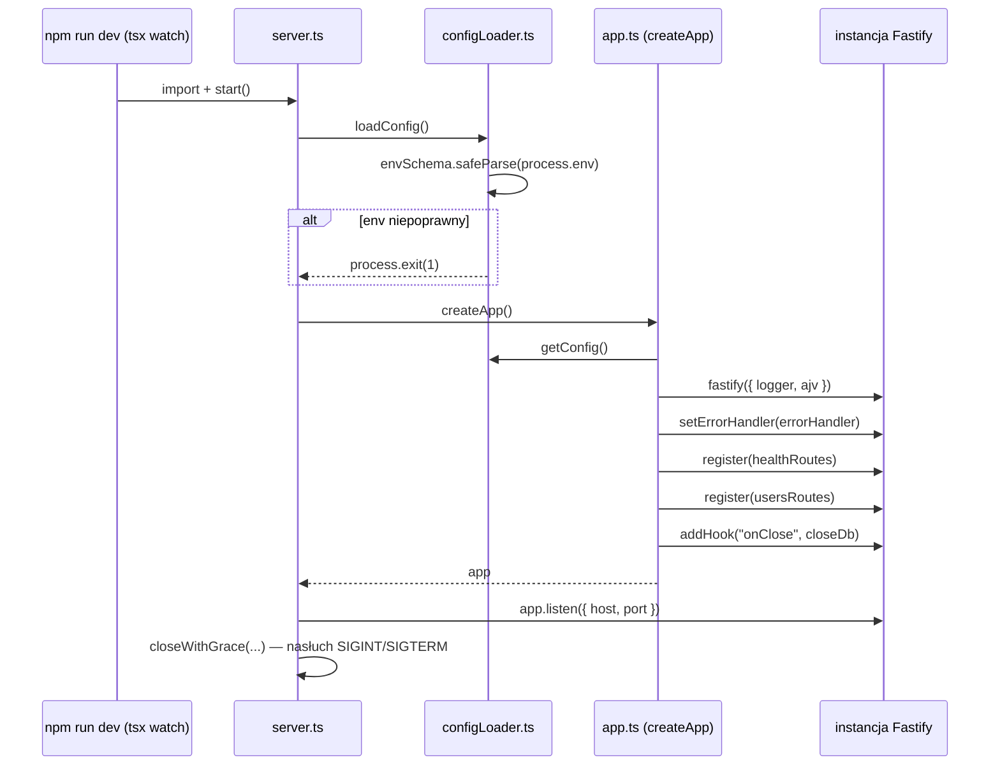
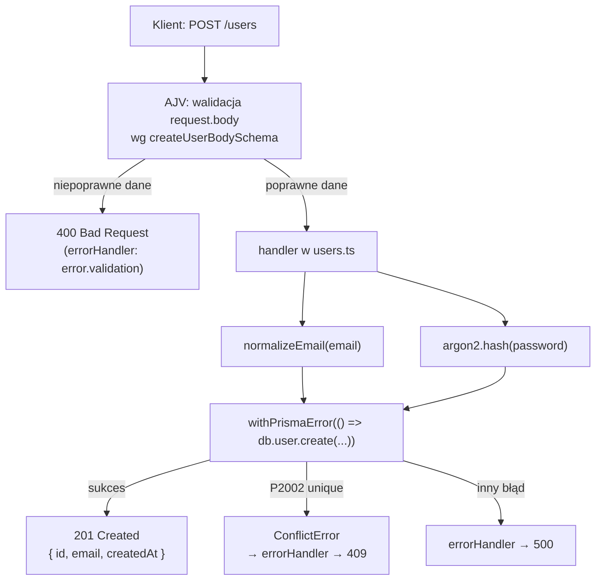

# 00 — Przegląd i cykl życia żądania

## Dwa punkty wejścia

Projekt ma dwa istotne pliki startowe:

| Plik | Rola |
|---|---|
| [`src/server.ts`](../../src/server.ts) | uruchamia realny proces Node.js — nasłuchuje na porcie, obsługuje graceful shutdown |
| [`src/app.ts`](../../src/app.ts) | fabryka aplikacji Fastify (`createApp()`) — używana zarówno przez `server.ts`, jak i przez testy (`app.inject()`, bez realnego portu) |

Ten podział jest celowy: testy (`test/health.test.ts`, `test/integration/users.test.ts`)
mogą stworzyć instancję Fastify przez `createApp()` i wysyłać do niej żądania
w pamięci, bez otwierania prawdziwego gniazda sieciowego.

## Kolejność startu (`npm run dev` → serwer nasłuchuje)

**Uwaga o kolejności**: `loadConfig()` musi zostać wywołane *przed*
`createApp()`, bo `createApp()` woła `getConfig()`, które rzuca wyjątek, jeśli
konfiguracja nie została jeszcze wczytana. Zobacz
[`02-konfiguracja-i-start.md`](./02-konfiguracja-i-start.md).

## Cykl życia pojedynczego żądania HTTP

Na przykładzie `POST /users` (zobacz [`src/routes/users.ts`](../../src/routes/users.ts)):

## Co dalej

- Jak dokładnie działa routing i walidacja schematów: [`01-fastify-podstawy.md`](./01-fastify-podstawy.md)
- Jak działa `loadConfig()`/`getConfig()`: [`02-konfiguracja-i-start.md`](./02-konfiguracja-i-start.md)
- Jak błędy trafiają do `errorHandler`: [`03-obsluga-bledow.md`](./03-obsluga-bledow.md)

