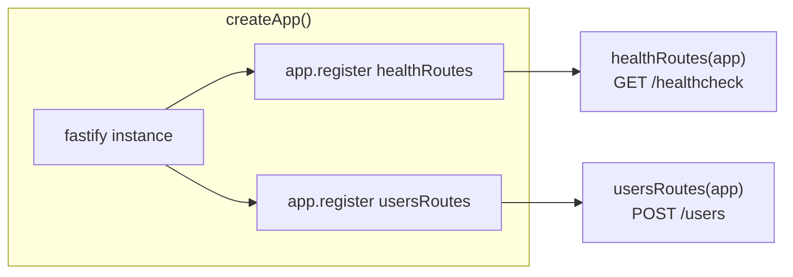
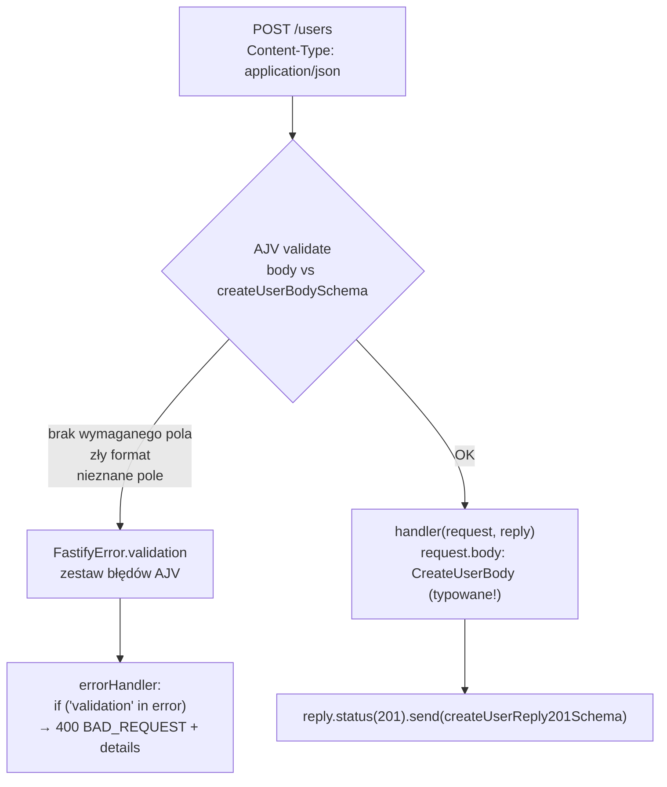

# 01 — Fastify: routing, pluginy, walidacja schematów

## Trasy jako pluginy Fastify

W tym projekcie **każda trasa to osobny plugin Fastify** — zwykła funkcja
`async (app) => { ... }` eksportowana jako `export default`. Przykład:
[`src/routes/health.ts`](../../src/routes/health.ts) i
[`src/routes/users.ts`](../../src/routes/users.ts).

Ważna konwencja projektu (patrz [`AGENTS.md`](../../AGENTS.md)): **nie ma
autoloadingu**. Mimo że `@fastify/autoload` jest w `package.json`, nie jest
używany — każdą trasę trzeba jawnie zarejestrować w
[`src/app.ts`](../../src/app.ts):

```ts
app.register(healthRoutes);
app.register(usersRoutes);
```

To celowa decyzja: jawna lista rejestracji ułatwia śledzenie, jakie endpointy
istnieją, bez przeszukiwania systemu plików.



## Schematy JSON jako źródło prawdy

Zamiast pisać walidację ręcznie, projekt definiuje schematy JSON Schema w
[`src/schemas/`](../../src/schemas) przy użyciu `json-schema-to-ts`. Wzorzec z
[`src/schemas/users.ts`](../../src/schemas/users.ts):

```ts
export const createUserBodySchema = {
  type: "object",
  required: ["email", "password"],
  additionalProperties: false,
  properties: {
    email: { type: "string", format: "email" },
    password: { type: "string", minLength: 8, maxLength: 72 },
  },
} as const satisfies JSONSchema;

export type CreateUserBody = FromSchema<typeof createUserBodySchema>;
```

`as const satisfies JSONSchema` + `FromSchema<...>` daje **jedno źródło
prawdy**: ten sam obiekt jest używany zarówno do walidacji w runtime (AJV), jak
i do wygenerowania typu TypeScript `CreateUserBody` używanego w handlerze.
Dzięki temu typ i walidacja nigdy się nie rozjadą.

## Dlaczego `removeAdditional: false`?

Domyślnie AJV w Fastify po cichu **usuwa** nieznane pola z body zamiast je
odrzucać, nawet gdy `additionalProperties: false`. W
[`src/app.ts`](../../src/app.ts) to zachowanie jest świadomie wyłączone:

```ts
ajv: {
  customOptions: { removeAdditional: false },
  plugins: [ajvFormats.default],
}
```

Dzięki temu żądanie z nieoczekiwanym polem (np. `role: "admin"` wysłane przez
atakującego) dostaje **400**, zamiast zostać po cichu przefiltrowane — patrz
test `"returns 400 when unknown fields are present"` w
[`test/integration/users.test.ts`](../../test/integration/users.test.ts).

`ajv-formats` jest dołączony jako plugin, żeby wspierać `format: "email"` —
bez niego AJV samo nie rozumie formatu `"email"`.

## Pełny przepływ walidacji żądania



## Response schema — kontrakt wyjściowy też jest opisany

Sekcja `response: { 201: createUserReply201Schema, 400: errorReplySchema }` w
handlerze definiuje też **kształt odpowiedzi**. Fastify serializuje odpowiedź
zgodnie z tym schematem (szybszy JSON serializer + gwarancja, że przez
przypadek nie wyciekną dodatkowe pola, np. `passwordHash`).

## Zobacz też

- [`00-przeglad.md`](./00-przeglad.md) — jak to się wpina w cały cykl żądania
- [`03-obsluga-bledow.md`](./03-obsluga-bledow.md) — co się dzieje z błędami walidacji dalej

