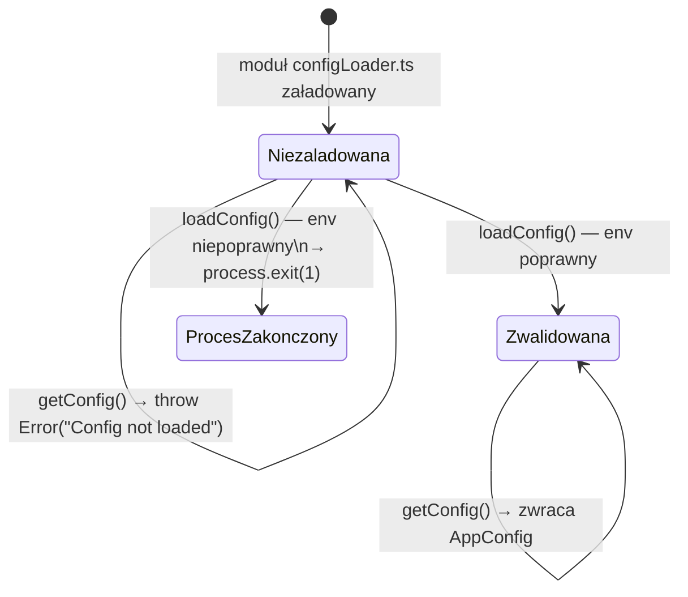

# 02 — Konfiguracja i start aplikacji

## Walidacja zmiennych środowiskowych przez Zod

Wszystkie zmienne środowiskowe są opisane jednym schematem Zod w
[`src/config/env.ts`](../../src/config/env.ts):

```ts
export const envSchema = z.object({
  NODE_ENV: z.enum(["development", "test", "production"]).default("development"),
  PORT: z.coerce.number().default(3000),
  HOST: z.string().default("0.0.0.0"),
  LOG_LEVEL: z.enum([...]).default("info"),
  DATABASE_URL: z.url(),
});
```

Jedyna wymagana zmienna bez wartości domyślnej to `DATABASE_URL`. Reszta ma
sensowne domyślne wartości dla środowiska deweloperskiego.

## Singleton konfiguracji: `loadConfig()` vs `getConfig()`

[`src/config/configLoader.ts`](../../src/config/configLoader.ts) eksportuje
dwie różne funkcje o różnym przeznaczeniu — to częsty punkt pomyłki dla osób
nowych w projekcie:

| Funkcja | Kiedy używać | Zachowanie przy błędzie |
|---|---|---|
| `loadConfig()` | **raz**, na starcie procesu (`server.ts`) lub w `beforeAll` testów | jeśli env jest niepoprawny → loguje błąd i `process.exit(1)` |
| `getConfig()` | wewnątrz handlerów tras / `createApp()` / `getDb()` | jeśli `loadConfig()` nie zostało jeszcze wywołane → rzuca `Error` |



## Dlaczego to rozróżnienie ma znaczenie

`getDb()` ([`src/lib/db.ts`](../../src/lib/db.ts)) i `createApp()`
([`src/app.ts`](../../src/app.ts)) wołają `getConfig()`, **nie** `loadConfig()`.
Gdyby wołały `loadConfig()` na poziomie modułu (top-level), testy importujące
te moduły przed przygotowaniem środowiska testowego by się wywalały. Dlatego
`AGENTS.md` jasno mówi: *"Access config via `getConfig()` inside route
handlers/plugins (never at module top-level)"*.

Prawidłowy wzorzec w testach (patrz
[`test/health.test.ts`](../../test/health.test.ts)):

```ts
beforeAll(() => {
  loadConfig();      // ⬅ musi być pierwsze
  app = createApp(); // ⬅ wewnątrz woła getConfig()
});
```

Jeśli kolejność zostanie odwrócona, `createApp()` rzuci
`"Config not loaded. Call loadConfig() first."`.

## Logger zależny od konfiguracji

[`src/config/loggerConfig.ts`](../../src/config/loggerConfig.ts) buduje
konfigurację loggera Fastify (Pino) na podstawie `AppConfig`:

- poziom logowania z `LOG_LEVEL`,
- redakcja pól wrażliwych (`req.headers.authorization`, `body.password`,
  `body.refreshToken`, ...) — nigdy nie trafiają do logów w czystej postaci,
- logger jest **całkowicie wyłączony** (`false`), gdy `NODE_ENV === "test"`
  (patrz [`src/app.ts`](../../src/app.ts)) — testy nie zaśmiecają konsoli.

## Zobacz też

- [`00-przeglad.md`](./00-przeglad.md) — pełna sekwencja startu procesu
- [`05-testowanie.md`](./05-testowanie.md) — dlaczego `NODE_ENV=test` jest ważny dla `resetTestDatabase()`

