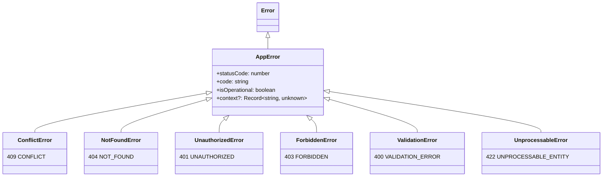
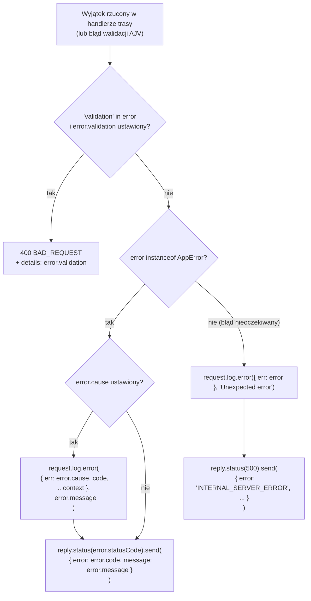

# 03 — Obsługa błędów

> Ten rozdział to skrótowe wprowadzenie do konwencji błędów w projekcie.
> Pełny, szczegółowy opis przepływu dla błędów Prisma znajduje się w
> [`docs/prisma-error-handling.md`](../prisma-error-handling.md) — jeśli
> potrzebujesz drobiazgowego wyjaśnienia "co się loguje, a co nie", zajrzyj
> tam.

## Zasada projektu: throw, nie reply

Zamiast ręcznie wołać `reply.status(...).send(...)` w każdym handlerze przy
błędzie, konwencja projektu ([`AGENTS.md`](../../AGENTS.md)) mówi: **rzucaj
odpowiedni podtyp `AppError`**, a globalny error handler zamieni go na
poprawną odpowiedź HTTP:

```ts
// ✅ poprawnie
throw new ConflictError("Email already registered");

// ❌ niepoprawnie — omija centralne logowanie i spójny kształt odpowiedzi
reply.status(409).send({ error: "CONFLICT", message: "..." });
```

## Hierarchia klas błędów



Wszystkie podtypy żyją w [`src/errors/domain/`](../../src/errors/domain).
Każdy z nich w konstruktorze z góry ustala `statusCode` i `code` — handler nie
musi się już martwić, jaki kod HTTP odpowiada danemu błędowi domenowemu.

`AppError` (bazowa klasa, [`src/errors/AppError.ts`](../../src/errors/AppError.ts))
dodatkowo:
- przechowuje opcjonalny `cause` (oryginalny, "surowy" błąd — np. z Prisma),
- przechowuje opcjonalny `context` (diagnostyka do logów, np.
  `{ operation, model, prismaCode }`),
- woła `Error.captureStackTrace`, żeby stack trace wskazywał na miejsce
  utworzenia błędu domenowego, a nie na wnętrze klasy `AppError`.

## Decyzja globalnego error handlera

[`src/errors/errorHandler.ts`](../../src/errors/errorHandler.ts) to
**jedyne miejsce w aplikacji**, które faktycznie wywołuje `reply.send(...)` dla
błędów oraz `request.log.error(...)`:



Kluczowa zasada bezpieczeństwa: dla błędów **nieoczekiwanych** (nie-`AppError`)
klient dostaje zawsze generyczny komunikat 500 — szczegóły (stack trace,
treść wyjątku) trafiają tylko do logów serwera, nigdy do odpowiedzi HTTP.

## Prisma jako źródło błędów domenowych

[`src/lib/prismaErrors.ts`](../../src/lib/prismaErrors.ts) mapuje konkretne
kody błędów Prisma na powyższe klasy domenowe:

| Kod Prisma | Znaczenie | Klasa błędu |
|---|---|---|
| `P2002` | naruszenie unikalności (np. duplikat e-maila) | `ConflictError` (409) |
| `P2025` | rekord nie znaleziony | `NotFoundError` (404) |
| inny | nieobsłużony | przepuszczony dalej (`throw err`) bez zmian |

Każde wywołanie musi jawnie podać kontekst operacji:

```ts
const user = await withPrismaError(
  () => getDb().user.create({ data: { email, passwordHash } }),
  { operation: "create", model: "User" },
);
```

Pełny diagram tego przepływu (razem z przykładowym logiem JSON) jest w
[`docs/prisma-error-handling.md`](../prisma-error-handling.md).

## Zobacz też

- [`04-baza-danych-prisma.md`](./04-baza-danych-prisma.md) — skąd biorą się błędy `P2002`/`P2025`
- [`docs/prisma-error-handling.md`](../prisma-error-handling.md) — pełny opis (PL, bardzo szczegółowy)

