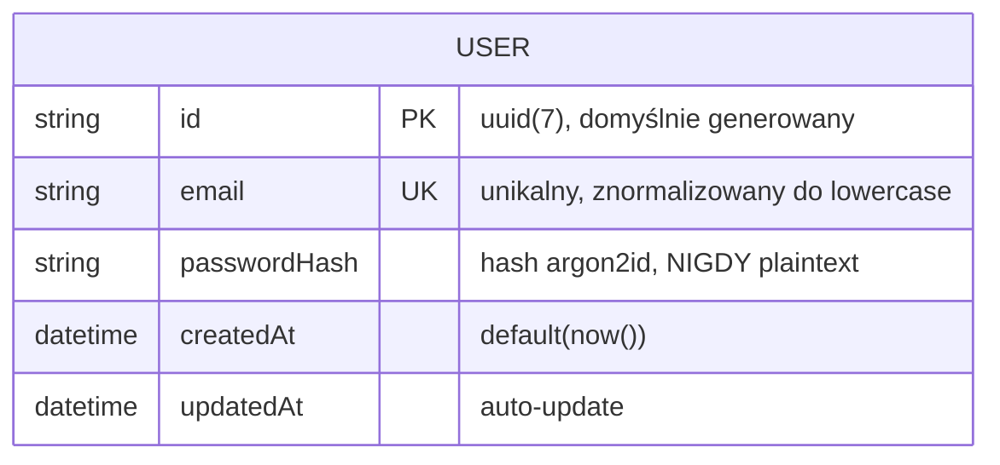
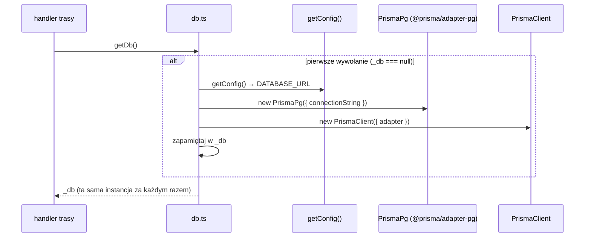
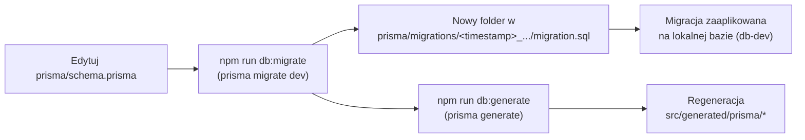
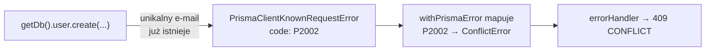

# 04 — Baza danych i Prisma

## Model danych

Jedyny model w [`prisma/schema.prisma`](../../prisma/schema.prisma) to `User`:

Uwagi:
- `id` używa `uuid(7)` — UUID w wersji 7 jest sortowalny w czasie (przydatne
  do indeksów i paginacji po czasie utworzenia), w odróżnieniu od losowego
  `uuid(4)`.
- Tabela jest zmapowana na `users` (`@@map("users")`) — konwencja: nazwa
  modelu Prisma w PascalCase, nazwa tabeli SQL w snake_case/liczbie mnogiej.
- Generator Prisma Client (`provider = "prisma-client"`) generuje kod do
  [`src/generated/prisma/`](../../src/generated/prisma) — **nigdy nie edytuj
  tych plików ręcznie**, tylko uruchom `npm run db:generate` po zmianie
  schematu.

## Singleton `getDb()` i adapter sterownika

[`src/lib/db.ts`](../../src/lib/db.ts) nie tworzy `PrismaClient` na starcie
modułu — robi to leniwie, przy pierwszym wywołaniu `getDb()`:

Dlaczego to ważne:
- **Leniwa inicjalizacja** oznacza, że `getDb()` też zależy od `getConfig()`,
  więc — tak samo jak `createApp()` — nie może być wołane na poziomie modułu
  (patrz [`02-konfiguracja-i-start.md`](./02-konfiguracja-i-start.md)).
- **Singleton** (`_db` w domknięciu modułu) zapobiega tworzeniu wielu puli
  połączeń do bazy w ramach jednego procesu.
- `PrismaPg` to *driver adapter* — warstwa pośrednicząca między Prisma Client
  a biblioteką `pg` (surowy sterownik Postgresa). To standardowy sposób
  konfiguracji połączenia w Prisma ORM 7.
- `closeDb()` jest wołane w hooku `onClose` aplikacji Fastify
  ([`src/app.ts`](../../src/app.ts)) — połączenie do bazy jest poprawnie
  zamykane przy zatrzymaniu serwera (`close-with-grace` w
  [`src/server.ts`](../../src/server.ts)).

## Migracje: jak zmiana w `schema.prisma` trafia do bazy

Dla testów integracyjnych osobna baza (`db-test`, port 5433) jest
migrowana komendą `npm run db:migrate:test`, która używa `prisma migrate
deploy` (bez interaktywnego promptu, bez tworzenia nowych plików migracji —
tylko aplikuje istniejące).

## Od błędu Prisma do odpowiedzi HTTP (skrót)

Szczegóły w [`03-obsluga-bledow.md`](./03-obsluga-bledow.md) i
[`docs/prisma-error-handling.md`](../prisma-error-handling.md). W skrócie:

## Zobacz też

- [`03-obsluga-bledow.md`](./03-obsluga-bledow.md) — hierarchia błędów i globalny handler
- [`05-testowanie.md`](./05-testowanie.md) — jak testy integracyjne korzystają z realnej bazy `db-test`

