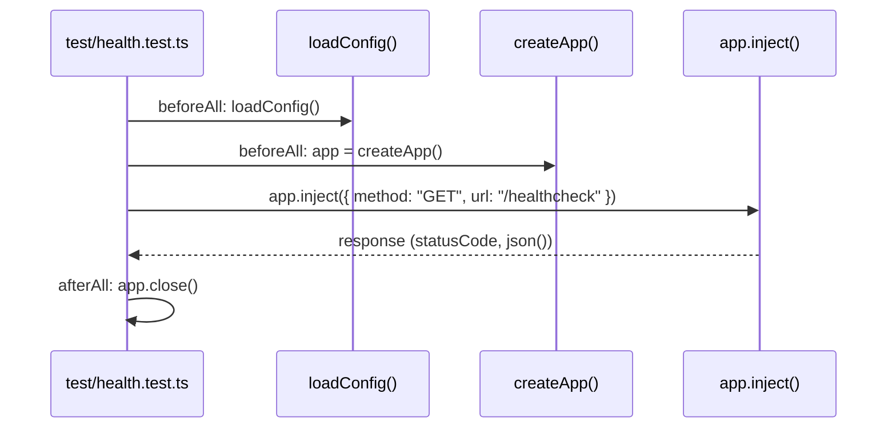
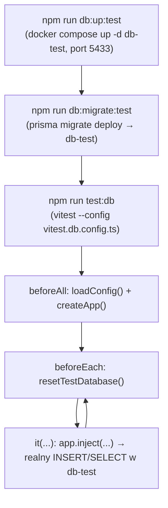
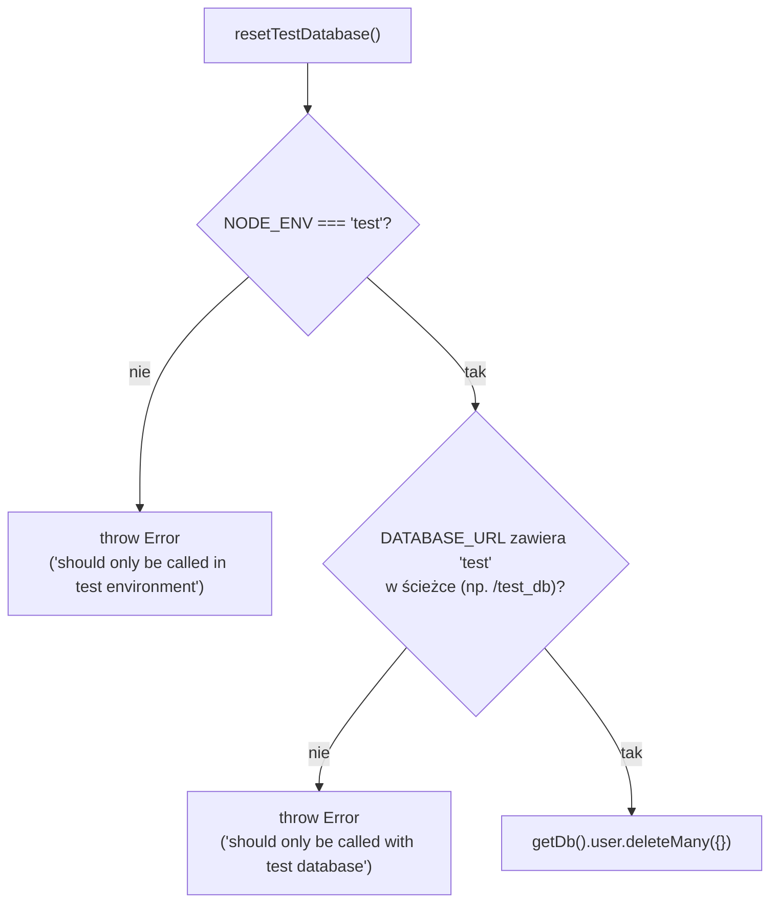

# 05 — Testowanie

Projekt ma dwa różne rodzaje testów, uruchamiane osobnymi komendami i osobną
konfiguracją Vitest ([`vitest.config.ts`](../../vitest.config.ts) vs
[`vitest.db.config.ts`](../../vitest.db.config.ts)).

## Testy jednostkowe/trasowe — bez realnej bazy, bez realnego portu

Przykład: [`test/health.test.ts`](../../test/health.test.ts). Nie otwierają
prawdziwego gniazda TCP — używają `app.inject()`, metody Fastify, która
symuluje żądanie HTTP w pamięci procesu.

Te testy uruchamiane są komendą `npm test` (`vitest run`) i **wykluczają**
folder `test/integration/**` (patrz `exclude` w
[`vitest.config.ts`](../../vitest.config.ts)) — nie potrzebują żadnej bazy
danych i działają szybko/w izolacji.

## Testy integracyjne — realna baza Postgres

Przykład: [`test/integration/users.test.ts`](../../test/integration/users.test.ts).
Te testy uderzają w prawdziwą instancję Postgresa (`db-test`, port 5433,
osobny kontener Docker od bazy deweloperskiej).

`vitest.db.config.ts` ustawia `include: test/integration/**` i
`fileParallelism: false` — testy integracyjne muszą działać **sekwencyjnie**,
bo współdzielą tę samą bazę i ją czyszczą między testami; równoległe
uruchomienie powodowałoby wyścigi (jeden test czyści tabelę, gdy inny właśnie
coś do niej wstawia).

## `resetTestDatabase()` — bezpieczne czyszczenie bazy

[`test/clearDb.ts`](../../test/clearDb.ts) czyści tabelę `users` przed każdym
testem (`beforeEach`), ale ma dwa zabezpieczenia przed katastrofą (np.
przypadkowe uruchomienie na bazie produkcyjnej):

Te dwa warunki to prosta, ale skuteczna ochrona: nawet błąd w konfiguracji
środowiska (`.env` wskazujący przypadkiem na bazę deweloperską/produkcyjną)
nie spowoduje wyczyszczenia niewłaściwej bazy danych.

## Podsumowanie różnic

| | Testy jednostkowe (`npm test`) | Testy integracyjne (`npm run test:db`) |
|---|---|---|
| Plik konfiguracyjny | `vitest.config.ts` | `vitest.db.config.ts` |
| Lokalizacja | `test/*.test.ts` | `test/integration/**` |
| Baza danych | brak (nie dotyka DB) | realny Postgres (`db-test`, port 5433) |
| Wymaga migracji przed uruchomieniem | nie | tak (`npm run db:migrate:test`) |
| Równoległość | domyślna (Vitest) | wyłączona (`fileParallelism: false`) |
| Czyszczenie stanu | n/d | `resetTestDatabase()` w `beforeEach` |

Pełny gate przed pushem: `npm run qc` = `check` (Biome) + `typecheck` (tsc)
+ `test` (jednostkowe) + `test:db` (integracyjne).

## Zobacz też

- [`04-baza-danych-prisma.md`](./04-baza-danych-prisma.md) — skąd bierze się `getDb()` używane w testach integracyjnych
- [`02-konfiguracja-i-start.md`](./02-konfiguracja-i-start.md) — dlaczego `loadConfig()` musi poprzedzać `createApp()` również w testach

