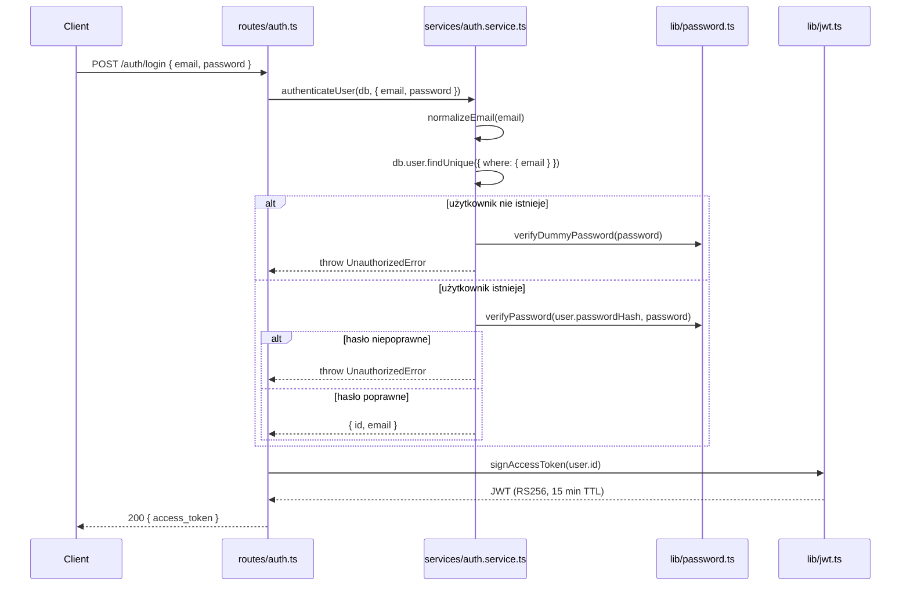
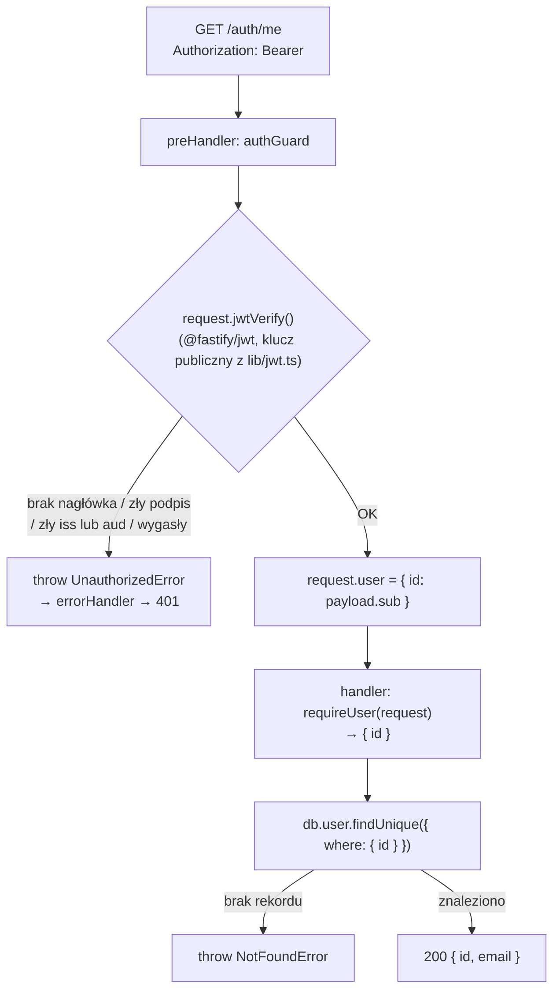

# 06 — Logowanie, JWT i `authGuard`

> Teoria stojąca za JWT (JWS/JWE, HS256 vs RS256, standardowe claimy, dobre i
> złe praktyki) jest opisana osobno w [`docs/jwt-manual.md`](../jwt-manual.md)
> i [`docs/jwt-cheatsheet.html`](../jwt-cheatsheet.html) — ten rozdział pokazuje
> **jak te koncepcje są faktycznie użyte w kodzie** tego projektu.

## Dwie trasy w `src/routes/auth.ts`

| Trasa | Metoda | Chroniona? | Co robi |
|---|---|---|---|
| `/auth/login` | `POST` | nie | weryfikuje email+hasło, zwraca `{ access_token }` |
| `/auth/me` | `GET` | tak (`authGuard`) | zwraca `{ id, email }` zalogowanego użytkownika |

## `POST /auth/login` — od żądania do tokena



### Dlaczego `verifyDummyPassword` dla nieistniejącego e-maila?

To obrona przed **atakiem czasowym (timing attack)**, który pozwoliłby
atakującemu odróżnić "zły e-mail" od "zły hasło" mierząc czas odpowiedzi:
`argon2.verify()` jest celowo kosztowny obliczeniowo (to jego zaleta przy
łamaniu haseł brute-force), więc jeśli serwer odpowiadałby *natychmiast* przy
nieznanym e-mailu, a *po opóźnieniu* przy znanym e-mailu + złym haśle,
atakujący mógłby w ten sposób enumerate'ować zarejestrowane adresy e-mail bez
jednego poprawnego logowania. `verifyDummyPassword()` hashuje/weryfikuje
wobec **stałego, precomputed** hasha, żeby obie ścieżki trwały podobnie
długo — i dlatego test `"produces an IDENTICAL response body..."` w
[`test/integration/auth.test.ts`](../../test/integration/auth.test.ts)
sprawdza również, że treść odpowiedzi jest **identyczna** w obu przypadkach
(nie tylko czas — żeby nie wyciekało nic przez treść JSON-a).

## Jak podpisywany jest token — `src/lib/jwt.ts`

Projekt używa **RS256** (asymetryczny) mimo że dziś jest jedynym
weryfikatorem własnych tokenów — przygotowuje to grunt pod przyszłe
mikroserwisy, które mogłyby weryfikować tokeny mając tylko klucz publiczny
(patrz tabela HS256 vs RS256 w `docs/jwt-manual.md`, §5).

- **Klucz prywatny**: z env (`JWT_PRIVATE_KEY_BASE64`, base64 z PKCS8 PEM) w
  produkcji; w dev/test — jeśli brak zmiennej — generowany efemerycznie w
  pamięci przy pierwszym użyciu (`generateRsaKeyPair()`), więc **restart
  procesu unieważnia wszystkie wcześniej wydane tokeny** w dev.
- **Klucz publiczny**: wyliczany z prywatnego (`createPublicKey`), nigdy nie
  trzeba trzymać go osobno w env.
- **Claimy**: `sub` = userId, `iss = "auth-service"`, `aud = "users-api"`,
  `iat`, `exp` (15 minut) — zgodnie z zaleceniami z §7/§8
  `docs/jwt-manual.md` (krótki czas życia, minimalny payload, `sub` jako
  klucz do odczytu reszty danych z bazy).
- Generowanie klucza (`getSigningKeyPair()`) jest **cache'owane w module**
  (`keyPairPromise`) — ta sama para kluczy jest używana do każdego
  podpisania/weryfikacji w ramach jednego procesu.

## Weryfikacja tokena na chronionych trasach — `authGuard`

Ciekawy detal implementacyjny: token jest **podpisywany** przez `jose`
(`signAccessToken` w `lib/jwt.ts`), ale **weryfikowany** przez
`@fastify/jwt` (`request.jwtVerify()` w `lib/authGuard.ts`) — dwie różne
biblioteki dla dwóch stron tego samego procesu. `app.ts` rejestruje
`@fastify/jwt` tylko z kluczem **publicznym** (`secret: { public:
getPublicKeyPem }`), czyli ta wtyczka w tym projekcie **tylko weryfikuje**,
nigdy nie podpisuje:

```ts
// src/app.ts
app.register(fastifyJwt, {
  secret: { public: getPublicKeyPem },
  verify: { algorithms: ["RS256"], allowedIss: ISSUER, allowedAud: AUDIENCE },
});
```



### Dlaczego `requireUser()`, a nie `request.user` bezpośrednio?

`@fastify/jwt` deklaruje typ `FastifyRequest.user`, który jest obecny na
**każdym** requeście w typach — także na trasach bez `authGuard` jako
`preHandler`. Gdyby handler czytał `request.user.id` wprost, TypeScript by to
zaakceptował nawet na niechronionej trasie, a w runtime wywaliłoby się na
`undefined.id`. `src/lib/authGuard.ts` celowo deklaruje typ jako
`{ id: string } | undefined` i eksportuje `requireUser(request)`, które rzuca
czytelny błąd ("called on a route without authGuard as preHandler") zamiast
cichego `undefined`-a — błąd konfiguracji trasy ujawnia się od razu, zamiast
dawać mylący stack trace w głębi logiki biznesowej.

## Refresh tokeny — co istnieje, a czego jeszcze nie ma

[`prisma/schema.prisma`](../../prisma/schema.prisma) ma już model
`RefreshToken` (hash tokena, `familyId`, `replacedByTokenId` do rotacji —
zobacz [`04-baza-danych-prisma.md`](./04-baza-danych-prisma.md)) i
[`src/services/refreshToken.service.ts`](../../src/services/refreshToken.service.ts)
potrafi **wydać** pierwszy token rodziny (`issueRefreshToken`). Natomiast:

- żadna trasa jeszcze **nie wywołuje** `issueRefreshToken` ani nie ustawia
  cookie z refresh tokenem — `POST /auth/login` zwraca dziś wyłącznie
  `access_token`;
- `rotateRefreshToken` i `revokeRefreshTokenFamily` istnieją tylko jako
  zakomentowane sygnatury (`// export async function rotateRefreshToken...`);
- nie ma tras `POST /auth/refresh` ani `POST /auth/logout`.

Pełny, docelowy przepływ (login → rotacja → wykrycie kradzieży → logout) jest
opisany jako wzorzec projektowy w
[`docs/token-lifecycle-diagrams.html`](../token-lifecycle-diagrams.html) i
[`docs/login-golden-standard.html`](../login-golden-standard.html) — to
materiał **do zaimplementowania**, nie opis obecnego stanu. Jeśli
implementujesz którąś z tych tras, zacznij od przeczytania obu plików, a
potem rozbij to na: (1) wydanie refresh tokena przy loginie + `httpOnly`
cookie, (2) `POST /auth/refresh` z rotacją, (3) wykrycie ponownego użycia
starego tokena jako sygnału kompromitacji, (4) `POST /auth/logout`.

## Zobacz też

- [`docs/jwt-manual.md`](../jwt-manual.md) — teoria JWT/JWS, HS256 vs RS256, standardowe claimy
- [`docs/token-lifecycle-diagrams.html`](../token-lifecycle-diagrams.html) — docelowy cykl życia refresh tokenów (projekt, nie stan obecny)
- [`03-obsluga-bledow.md`](./03-obsluga-bledow.md) — dlaczego handlery rzucają `UnauthorizedError`, a nie wołają `reply.send` ręcznie
- [`04-baza-danych-prisma.md`](./04-baza-danych-prisma.md) — model `RefreshToken` w schemacie

